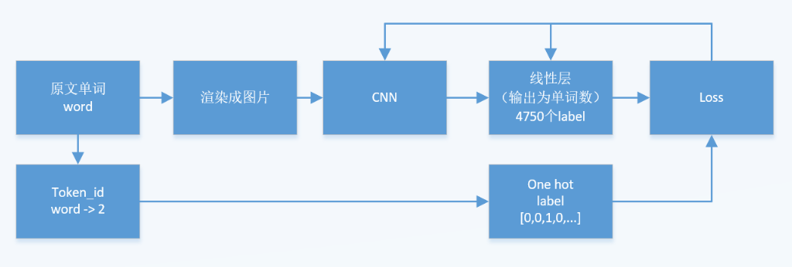
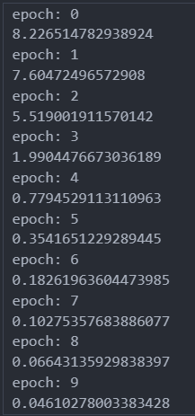
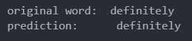
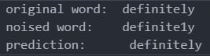
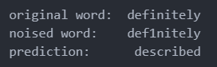
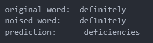
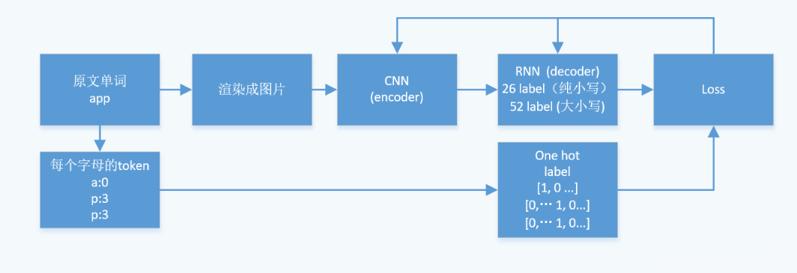
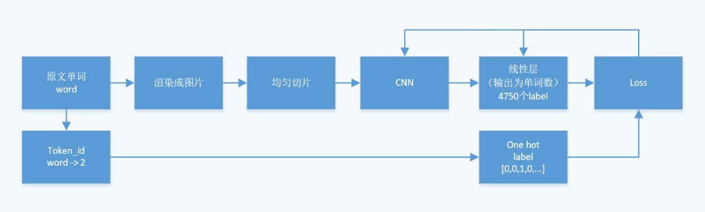
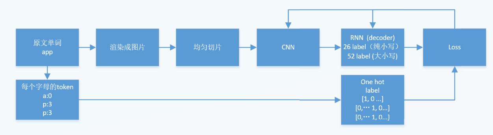

# cvdl_ss23
### 1) Requirements
 * python 3.6, pip

### 2) 设想与进度

#### 模型

##### 1. CNN + 线性层

    难点在于：一共有超过4000个单词，这对于线性层的预测是不是太多了？对于softmax来说是不是太多了？

    - 不过 纯CNN的中文的OCR是怎么训练的？中文OCR的vocabulary也很大。

进度：

- [x] 词汇表： \{word : id\}

- [x] 词汇表： \{id : word\}

- [x] 词频统计表： \{word : num\}

- [x] 创建Dataset和Dataloader，[教程1](https://pytorch.org/tutorials/beginner/data_loading_tutorial.html), [教程2](https://pytorch.org/tutorials/beginner/basics/data_tutorial.html)

- [x] 已经完成训练，效果还不错。看来线性层是可以预测超过4000个单词的。

    效果是：

    - 训练loss

    - 

    1. 无noise的单词时，正确

        

    2. 有1个noise的单词时，正确

        

    3. noise比较多的时候，错误

        
        
        

- [x] 绘制训练时loss和acc的变化图

- [ ] 优化：渲染图像的时候，检测图像是否已经渲染，这样就能免不同epoch的时候多次渲染

- [x] eval：自动添加 noise，参数：比例、noise类别

- [x] eval：专门给noise用的dataset

- [x] eval：单词和noise的mapping关系，已经完成leetspeak、希腊、西里尔字母

- [x] eval：测试每个单词的accuracy

- [ ] eval： 在不同noise比例下的accuracy，正在进行。。。

- [ ] 优化: to_image() 保存noised word的图片的时候，文件名中添加原单词（目前文件名只有noise单词

- [ ] 优化: 文件名里包含字体名

- [x] 自动化：更简洁的代码、更方便的调整超参数和训练

- [ ] 自动化：自动计算线性层输入端的size，根据图片大小、conv2d、max_pooling计算feature map的大小

- [ ] 超参数：字体、图片大小、字体大小、filter size、stride 等

- [ ] 如有必要，从.ipynb移植到.py

##### 2. CNN + RNN

    这个结构是为了解决label数量太多而设想的，CRNN是OCR的主流。[百度的飞桨](https://github.com/PaddlePaddle/PaddleOCR/tree/release/2.6rc) 及其 [教程](https://github.com/PaddleOCR-Community/Dive-into-OCR/blob/main/notebook_ch/3.text_recognition/%E6%96%87%E6%9C%AC%E8%AF%86%E5%88%AB%E7%90%86%E8%AE%BA%E9%83%A8%E5%88%86.ipynb)  和 [腾讯的NCNN](https://github.com/Tencent/ncnn/tree/master) 貌似都是使用这个架。

    这个架构原本是为了预测一句很长的话里的每个单词（但是每个位置的label依然很多？）。如果单词label的数量（即vocabulary的数量）很多的问题难以避免，只能用RNN作为decoder，来生成每个字母。这样label的数量就下降为26（纯小写）或者52（大小写）。

进度：

- [ ] 写RNN模型

- [ ] 重写词典：因为输出的label是字母，即 单词 - 单词的每个字母 - 单词的每个字母对应的ID，target 可能会是一个矩阵，即RNN输出的**每个**位置的字母的onehot label。即 $$N \times 26$$ 维度的矩阵

- [ ] 重写evaluation，因为输出不再是单词的token ID，用accuracy难以完整地评估，因此需要用BLEU之类的value来评估

- [ ] 调整超参数

##### 3. 图片切片 + CNN + 线性层

    论文的原作者的方法实际上是首先对图片进行切片，然后对每个切片的图片片段进行CNN，即对多张子图分别进行CNN，最后的结果相当于多个output feature maps, 最后拼接在一起，放入线性层里。

    - 这样是否能进一步减小CNN的尺寸呢？

进度：

   - [ ] 切片函数

##### 4. 图片切片 + CNN + RNN

##### 5. Report
   - [ ] Use PaperForReview.tex

##### 6. Video
   - [ ] Presentation
   - [ ] Zoom recording
   - [ ] Editing & Postprocessing

FAQ:

1. 是否有可能使用传统意义上的图像增强来增强训练集？

    > 现在做的事情是取代NLP领域里seq-to-seq结构，或者说关注在输入是token，输出是token的结构里，输入的token存在out of vocabulary的问题。这个模型或者说pipeline里的输入是token，输出也是token，图片只是中间过程。因此这不是一个OCR识别任务，而是一个着眼于解决seq-to-seq结构中OOV问题的任务。
    
    > 或许有可能使用 noised text来增强？