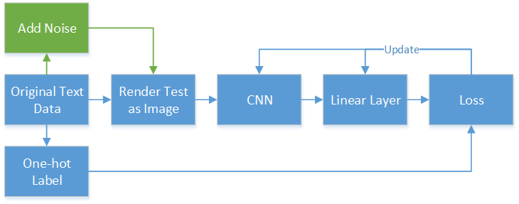

# cvdl_ss23

## Project: Vision-Based Approach to Noisy Text Recognition

Member: Han Yang, Yian Yu

### 1) Requirements
 * python 3.6, pip

### Structure

Progress

- [x] Dictionary \{word : id\}

- [x] Dictionary \{id : word\}

- [x] word frequency \{word : num\}

- [x] Dataset and Dataloader: [Tutorial 1](https://pytorch.org/tutorials/beginner/data_loading_tutorial.html), [Tutorial 2](https://pytorch.org/tutorials/beginner/basics/data_tutorial.html)

- [x] Training

    - Train loss

    - 

    1. Test without noise

        

    2. Test with 1 noise

        

    3. Test with many noise

        
        
        

- [x] loss, acc

- [x] eval: automatic noise, parameters, proportion, noise type
- [ ] 
- [x] eval: dataset / dataloader for noised data

- [x] eval: noise function

- [x] eval: test accuracy

- [x] eval: test accuracy with different noise, proportion

- [x] eval: move evaluation to a seperate file

- [x] optimize: to_image() better file name, contains original word

- [x] optimize: file name, contains font, noise name

- [x] automatic, clean code, automatic read and save config files

**Done Experiments**

1. 4 Models with 4 Fonts

2. For each model

    1. accuracy without noise, 4 results in total

    2. accuracy with 3 different noise
   
    3. accuracy with 5 different noise level (0.1, 0.2, 0.3, 0.4, 0.5)

    in total: $4  \text{model(fonts)} * 3 \text{type of noise} * 5 \text{noise level}  + 4 \text{accuracy without noise}  = 64$
